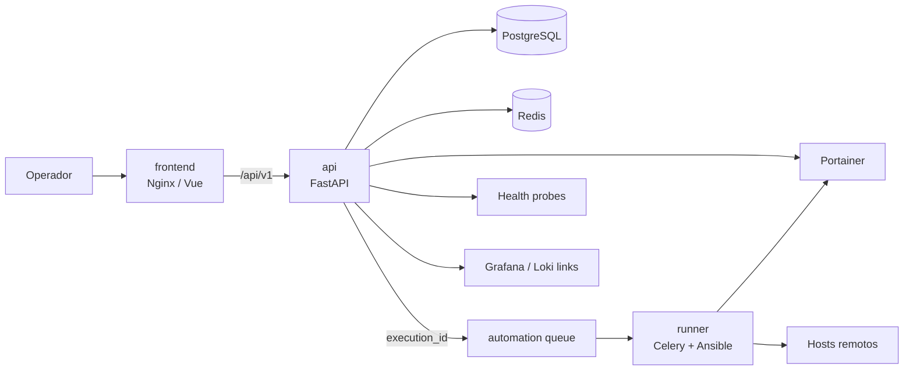

# Capataz

*Idioma: **Español** · [English](README.md)*

[](LICENSE)
[](docs/03-development.es.md)
[](docs/03-development.es.md)
[](docs/04-api.es.md)
[](docs/07-operations.es.md)
[](docs/03-development.es.md)
[](docs/01-architecture.es.md)

Capataz es una consola web privada para **ver y operar de forma controlada** los servicios Docker de un homelab distribuido. Agrupa servicios, agrega su estado, enlaza con Portainer/Grafana/Loki y orquesta acciones previamente declaradas con auditoría y RBAC.

No es un sustituto de Portainer, Grafana, Loki o Ansible; no acepta comandos shell, URLs de ejecución, nombres de contenedor ni playbooks arbitrarios enviados por cliente. La API valida, persiste, audita y encola. El `runner` ejecuta exclusivamente acciones allow-listed.

## Índice

- [Características](#características)
- [Arquitectura](#arquitectura)
- [Requisitos](#requisitos)
- [Quick start local](#quick-start-local)
- [Operación cotidiana](#operación-cotidiana)
- [Tests y calidad](#tests-y-calidad)
- [Documentación](#documentación)

## Características

- **Vista agregada** del estado de los servicios Docker, calculado a partir de Portainer y healthchecks propios.
- **Acciones pre-declaradas** (Ansible/Portainer) ejecutadas por un worker allow-listed — nunca comandos arbitrarios ni IDs de contenedor enviados por el cliente.
- **RBAC jerárquico** (`capataz-viewer` < `capataz-operator` < `capataz-admin`) con OIDC estándar (Authentik, Keycloak, Auth0, Cognito) o un modo `dev_mock` para desarrollo local.
- **Auditoría completa**: toda mutación queda registrada con identidad, origen, correlación y motivo.
- **Arquitectura hexagonal** en el backend (`api/`), un runner Celery aislado (`runner/`) y un frontend Vue 3 + Quasar (`frontend/`), cada uno con su propia imagen Docker.
- **Catálogo declarativo en YAML**, versionable, importable/exportable y sin secretos.

## Arquitectura



## Requisitos

- Docker Engine con Docker Compose v2 (`docker compose`).
- GNU Make, Git y OpenSSL para el flujo local.
- Para desarrollo nativo: Python 3.14+, [`uv`](https://docs.astral.sh/uv/), Node.js LTS y npm.
- Acceso de red únicamente a los endpoints declarados de Portainer, healthchecks y nodos de automatización.

## Quick start local

1. Copia la configuración no sensible y crea el directorio de secretos:

   ```bash
   cd /home/user/workspace/capataz
   cp .env.example .env
   mkdir -p secrets
   ```

2. Crea secretos locales. No los añadas a Git ni los pegues en `.env`:

   ```bash
   openssl rand -base64 36 > secrets/postgres_password
   openssl rand -base64 36 > secrets/redis_password
   echo 'REEMPLAZAR_CON_TOKEN_DE_PORTAINER_DE_MINIMO_PRIVILEGIO' > secrets/portainer_token
   echo 'REEMPLAZAR_SOLO_SI_SE_USA_COGNITO' > secrets/cognito_client_secret
   echo 'REEMPLAZAR_CON_CLAVE_SSH_DE_CUENTA_DE_AUTOMATIZACION' > secrets/runner_ssh_private_key
   echo 'host.example ssh-ed25519 AAAA...' > secrets/runner_known_hosts
   openssl rand -base64 36 > secrets/ansible_vault_password
   # 644, no 600: Compose monta estos ficheros por bind-mount preservando permisos, y los
   # contenedores corren como el usuario `capataz` (uid 10001), no como tu usuario del host.
   chmod 644 secrets/*
   ```

   `api` y `runner` no leen `postgres_password`/`redis_password` directamente (esos dos solo inicializan los contenedores `postgres`/`redis`): reciben el DSN completo — usuario, password, host, puerto y base de datos — como un único secreto (`database_url`/`redis_url`, ver ADR-006). Constrúyelos con la misma contraseña que acabas de generar:

   ```bash
   pg_pw=$(cat secrets/postgres_password)
   redis_pw=$(cat secrets/redis_password)
   printf 'postgresql+asyncpg://capataz:%s@postgres:5432/capataz' "$(python3 -c 'import sys,urllib.parse;print(urllib.parse.quote(sys.argv[1],safe=""))' "$pg_pw")" > secrets/database_url
   printf 'redis://:%s@redis:6379/0' "$(python3 -c 'import sys,urllib.parse;print(urllib.parse.quote(sys.argv[1],safe=""))' "$redis_pw")" > secrets/redis_url
   chmod 644 secrets/database_url secrets/redis_url
   unset pg_pw redis_pw
   ```

   Si cambias `CAPATAZ_POSTGRES_DB`/`CAPATAZ_POSTGRES_USER` en `.env`, actualiza también el usuario y la base de datos en `secrets/database_url` para que coincidan. Sustituye los marcadores antes de activar integraciones reales. La clave SSH debe pertenecer a una cuenta técnica limitada, nunca a tu usuario personal. Para una primera prueba sin Cognito, mantén `CAPATAZ_ENV=development` y `CAPATAZ_AUTH_MODE=dev_mock`. Para generar `portainer_token`, ver [«Token de Portainer» en
   docs/07-operations.es.md](docs/07-operations.es.md#token-de-portainer).

3. Construye y levanta el stack:

   ```bash
   make build
   make up
   make ps
   ```

4. Aplica migraciones y carga el catálogo de ejemplo. La API también puede importar el catálogo de forma idempotente al arrancar porque `CAPATAZ_INITIAL_CATALOG_YAML_PATH` apunta al fichero montado:

   ```bash
   make migrate
   make seed-catalog
   ```

5. Accede a `http://localhost:8080`. La API queda disponible en `http://localhost:8000/api/v1`; en modo `dev_mock` usa `X-Dev-User` y `X-Dev-Groups: capataz-admin` para probar privilegios administrativos.

El campo `icon` de servicios y acciones en el catálogo YAML (ver [Catálogo YAML](docs/05-yaml-catalog.es.md)) usa nombres de [Material Icons](https://fonts.google.com/icons?icon.set=Material+Icons) (p. ej. `memory`, `auto_awesome`), la librería de iconos que ya trae Quasar (`@quasar/extras/material-icons`) — cualquier nombre válido de esa página funciona directamente sin instalar nada más.

## Operación cotidiana

```bash
make logs                    # todos los logs
make logs service=api        # un servicio
make down                    # detiene el stack sin borrar volúmenes
make export-catalog > catalog/export.yaml
make security-scan
```

### Levantar un solo módulo

`api/`, `runner/` y `frontend/` tienen cada uno su propio `docker-compose.yml` para levantar
únicamente ese módulo (y, en el caso de `api`/`runner`, su propio PostgreSQL/Redis dedicados,
no compartidos entre módulos ni con el stack raíz). Reutilizan los mismos `secrets/` y `.env` de
la raíz:

```bash
make -C api up       # api + su propio postgres/redis, puerto 8000
make -C runner up    # runner + su propio postgres/redis
make -C frontend up  # solo frontend, puerto 8090
make -C <módulo> down / logs / ps
```

Ver el comentario de cabecera de cada `docker-compose.yml` para el alcance exacto (p. ej. cómo
`frontend` resuelve el hostname `api` de su proxy Nginx sin tener un contenedor `api` propio).

## Tests y calidad

```bash
make test
make test-unit
make test-integration
make test-e2e
make lint
make format
make typecheck
make coverage
```

La CI exige al menos 80% de cobertura en backend y frontend. Consulta [desarrollo](docs/03-development.es.md), [operaciones](docs/07-operations.es.md), [seguridad](docs/06-security.es.md) y los [criterios de aceptación](docs/01-architecture.es.md#cobertura-de-los-criterios-de-aceptación) para el procedimiento completo.

## Documentación

Numerados según el orden recomendado de lectura:

- [Arquitectura](docs/01-architecture.es.md)
- [Contrato de integración entre subproyectos](docs/02-contracts.es.md)
- [Desarrollo](docs/03-development.es.md)
- [Referencia API](docs/04-api.es.md)
- [Catálogo YAML](docs/05-yaml-catalog.es.md)
- [Seguridad](docs/06-security.es.md)
- [Operaciones](docs/07-operations.es.md)
- [Depuración](docs/08-debugging.es.md)
- [Configurar Authentik como proveedor OIDC](docs/09-authentik-oidc-setup.es.md)
- [Configurar AWS Cognito como proveedor OIDC](docs/10-cognito-oidc-setup.es.md)
- [Diseño futuro del runner efímero](docs/11-future-ephemeral-runner.es.md)
- [Roadmap de mejoras](docs/12-roadmap.es.md)
- [ADRs](docs/adr/)
