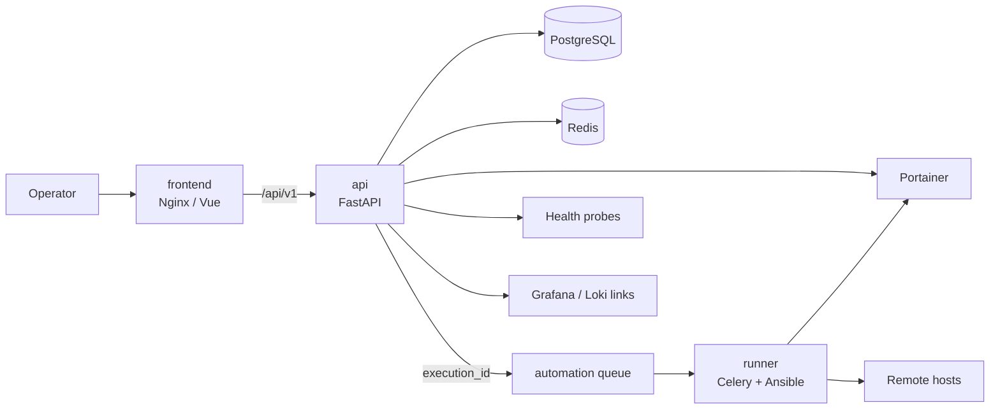

# Capataz

*Language: **English** · [Español](README.es.md)*

[](LICENSE)
[](docs/03-development.en.md)
[](docs/03-development.en.md)
[](docs/04-api.en.md)
[](docs/07-operations.en.md)
[](docs/03-development.en.md)
[](docs/01-architecture.en.md)

Capataz is a private web console to **view and operate, in a controlled way**, the Docker services of a distributed homelab. It aggregates services, rolls up their status, links out to Portainer/Grafana/Loki, and orchestrates pre-declared actions with audit and RBAC.

It is not a replacement for Portainer, Grafana, Loki, or Ansible; it does not accept shell commands, execution URLs, container names, or client-supplied arbitrary playbooks. The API validates, persists, audits, and enqueues. The `runner` executes only allow-listed actions.

## Table of Contents

- [Features](#features)
- [Architecture](#architecture)
- [Requirements](#requirements)
- [Local quick start](#local-quick-start)
- [Day-to-day operations](#day-to-day-operations)
- [Tests and quality](#tests-and-quality)
- [Documentation](#documentation)

## Features

- **Aggregated view** of Docker service status, computed from Portainer and its own health checks.
- **Pre-declared actions** (Ansible/Portainer) executed by an allow-listed worker — never arbitrary commands or client-supplied container IDs.
- **Hierarchical RBAC** (`capataz-viewer` < `capataz-operator` < `capataz-admin`) with standard OIDC (Authentik, Keycloak, Auth0, Cognito) or a `dev_mock` mode for local development.
- **Full audit trail**: every mutation is recorded with identity, source, correlation, and reason.
- **Hexagonal architecture** in the backend (`api/`), an isolated Celery runner (`runner/`), and a Vue 3 + Quasar frontend (`frontend/`), each with its own Docker image.
- **Declarative YAML catalog**, versionable, importable/exportable, and secret-free.

## Architecture



## Requirements

- Docker Engine with Docker Compose v2 (`docker compose`).
- GNU Make, Git, and OpenSSL for the local workflow.
- For native development: Python 3.14+, [`uv`](https://docs.astral.sh/uv/), Node.js LTS, and npm.
- Network access only to the declared Portainer, health-check, and automation-node endpoints.

## Local quick start

1. Copy the non-sensitive configuration and create the secrets directory:

   ```bash
   cd /home/user/workspace/capataz
   cp .env.example .env
   mkdir -p secrets
   ```

2. Create local secrets. Don't add them to Git or paste them into `.env`:

   ```bash
   openssl rand -base64 36 > secrets/postgres_password
   openssl rand -base64 36 > secrets/redis_password
   echo 'REPLACE_WITH_LEAST_PRIVILEGE_PORTAINER_TOKEN' > secrets/portainer_token
   echo 'REPLACE_ONLY_IF_USING_COGNITO' > secrets/cognito_client_secret
   echo 'REPLACE_WITH_AUTOMATION_ACCOUNT_SSH_KEY' > secrets/runner_ssh_private_key
   echo 'host.example ssh-ed25519 AAAA...' > secrets/runner_known_hosts
   openssl rand -base64 36 > secrets/ansible_vault_password
   # 644, not 600: Compose bind-mounts these files preserving permissions, and the
   # containers run as the `capataz` user (uid 10001), not as your host user.
   chmod 644 secrets/*
   ```

   `api` and `runner` don't read `postgres_password`/`redis_password` directly (those two only bootstrap the `postgres`/`redis` containers): they receive the full DSN — user, password, host, port, and database — as a single secret (`database_url`/`redis_url`, see ADR-006). Build them with the same password you just generated:

   ```bash
   pg_pw=$(cat secrets/postgres_password)
   redis_pw=$(cat secrets/redis_password)
   printf 'postgresql+asyncpg://capataz:%s@postgres:5432/capataz' "$(python3 -c 'import sys,urllib.parse;print(urllib.parse.quote(sys.argv[1],safe=""))' "$pg_pw")" > secrets/database_url
   printf 'redis://:%s@redis:6379/0' "$(python3 -c 'import sys,urllib.parse;print(urllib.parse.quote(sys.argv[1],safe=""))' "$redis_pw")" > secrets/redis_url
   chmod 644 secrets/database_url secrets/redis_url
   unset pg_pw redis_pw
   ```

   If you change `CAPATAZ_POSTGRES_DB`/`CAPATAZ_POSTGRES_USER` in `.env`, also update the user and database in `secrets/database_url` to match. Replace the placeholders before enabling real integrations. The SSH key should belong to a limited technical account, never your personal user. For a first test without Cognito, keep `CAPATAZ_ENV=development` and `CAPATAZ_AUTH_MODE=dev_mock`. To generate `portainer_token`, see [Portainer Token in
   docs/07-operations.en.md](docs/07-operations.en.md#portainer-token).

3. Build and bring up the stack:

   ```bash
   make build
   make up
   make ps
   ```

4. Apply migrations and load the sample catalog. The API can also import the catalog idempotently at startup, since `CAPATAZ_INITIAL_CATALOG_YAML_PATH` points at the mounted file:

   ```bash
   make migrate
   make seed-catalog
   ```

5. Go to `http://localhost:8080`. The API is available at `http://localhost:8000/api/v1`; in `dev_mock` mode, use `X-Dev-User` and `X-Dev-Groups: capataz-admin` to test admin privileges.

The `icon` field on services and actions in the YAML catalog (see [YAML Catalog](docs/05-yaml-catalog.en.md)) uses [Material Icons](https://fonts.google.com/icons?icon.set=Material+Icons) names (e.g. `memory`, `auto_awesome`), the icon library already bundled with Quasar (`@quasar/extras/material-icons`) — any valid name from that page works directly with nothing else to install.

## Day-to-day operations

```bash
make logs                    # all logs
make logs service=api        # a single service
make down                    # stops the stack without deleting volumes
make export-catalog > catalog/export.yaml
make security-scan
```

### Bringing up a single module

`api/`, `runner/`, and `frontend/` each have their own `docker-compose.yml` to bring up
only that module (and, for `api`/`runner`, their own dedicated PostgreSQL/Redis,
not shared between modules or with the root stack). They reuse the same root
`secrets/` and `.env`:

```bash
make -C api up       # api + its own postgres/redis, port 8000
make -C runner up    # runner + its own postgres/redis
make -C frontend up  # frontend only, port 8090
make -C <module> down / logs / ps
```

See the header comment in each `docker-compose.yml` for the exact scope (e.g. how
`frontend` resolves the `api` hostname for its Nginx proxy without having its own `api` container).

## Tests and quality

```bash
make test
make test-unit
make test-integration
make test-e2e
make lint
make format
make typecheck
make coverage
```

CI requires at least 80% coverage in backend and frontend. See [development](docs/03-development.en.md), [operations](docs/07-operations.en.md), [security](docs/06-security.en.md), and the [acceptance criteria](docs/01-architecture.en.md#acceptance-criteria-coverage) for the full procedure.

## Documentation

Numbered in recommended reading order:

- [Architecture](docs/01-architecture.en.md)
- [Cross-subproject integration contract](docs/02-contracts.en.md)
- [Development](docs/03-development.en.md)
- [API reference](docs/04-api.en.md)
- [YAML catalog](docs/05-yaml-catalog.en.md)
- [Security](docs/06-security.en.md)
- [Operations](docs/07-operations.en.md)
- [Debugging](docs/08-debugging.en.md)
- [Setting up Authentik as an OIDC provider](docs/09-authentik-oidc-setup.en.md)
- [Setting up AWS Cognito as an OIDC provider](docs/10-cognito-oidc-setup.en.md)
- [Future ephemeral runner design](docs/11-future-ephemeral-runner.en.md)
- [Improvement roadmap](docs/12-roadmap.en.md)
- [ADRs](docs/adr/)
