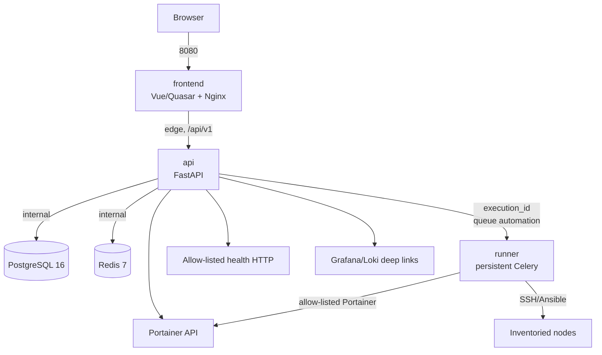

# Capataz Architecture

*Language: **English** · [Español](01-architecture.es.md)*

## Components and network boundaries

`frontend` and `api` share `edge`. `api`, `runner`, `postgres`, and `redis` share `internal`; the latter is internal to Compose. PostgreSQL and Redis are neither published nor joined to `edge` in the homelab profile. `runner` publishes no ports at all.

## Pragmatic hexagonal architecture

The backend is organized into `adapters`, `application`, `domain`, `infrastructure`, and `core`:

- **Domain**: entities, value objects, transitions, and exceptions. Never imports FastAPI, SQLAlchemy, Celery, or HTTP clients.
- **Application**: use cases, DTOs, RBAC policies, and `Protocol` ports. Depends only on the domain and abstractions.
- **Inbound adapters**: FastAPI routers, HTTP schemas, and authentication; convert HTTP to DTOs with no business decisions.
- **Outbound adapters / infrastructure**: async SQLAlchemy repositories, Celery, Portainer, health HTTP, secrets, and observability. Implement the application's ports.
- **Core**: `Settings`, logging, and cross-cutting policies.

The dependency direction always points toward the domain. A controller holds no business logic, and a use case knows nothing about a persistence, HTTP, Celery, or web-framework implementation. This separation is what lets the persistent executor be swapped for the ephemeral V2 one without rewriting use cases.

## Flow of an action

1. The authenticated user requests `POST /api/v1/services/{service_id}/actions/{action_key}/execute`.
2. The API resolves the service and its persisted definition; it validates role, `risk_level`, confirmation and reason for `critical`, enumerated parameters, and source.
3. The API creates an `Execution` in `queued` state, an `AuditEvent`, and an `X-Request-ID`/correlation ID; it never puts commands or secrets on the queue.
4. Exactly `{"execution_id":"<uuid>"}` is published to the Redis `automation` queue via `capataz_runner.tasks.process_execution`.
5. The runner atomically claims `queued -> running`, reloads the Service/ActionDefinition from PostgreSQL, and emits sanitized `ExecutionEvent`s.
6. A Portainer or Ansible adapter resolves only the selectors, operation, playbook, inventory, limit, and extra-vars present in the allow-listed definition.
7. The runner persists a terminal state, a safe summary, and events, and the API exposes the authenticated history/SSE.

## Security model

- **Allow-list**: there is no endpoint or payload for free shell, arbitrary container IDs, an execution URL, an external playbook, or unvalidated arguments.
- **Secrets**: Compose delivers them as files under `/run/secrets/<name>`; `api` reads them via a file reader. They are never stored in `.env`, the catalog, results, logs, or responses.
- **Hierarchical RBAC**: `capataz-viewer` reads; `capataz-operator` executes `read` and `operate`; `capataz-admin` administers, audits, and executes `critical`. The API always enforces the decision.
- **Isolation**: read-only filesystem where feasible, temporary tmpfs, `cap_drop: ALL`, `no-new-privileges`, non-root users on images that support it, and resource limits.
- **Integrations**: health URLs are validated against SSRF, and Portainer only operates on containers resolved from the catalog.
- **Traceability**: changes and executions record actor, source, result, timestamps, and correlation ID. HTTP errors use RFC 7807.

## V1 decisions and boundaries

V1 uses a persistent Celery worker and Redis as broker/result backend. The API contains no Ansible or SSH tooling. Grafana/Loki are resolved as deep links; Prometheus sits behind a future port, with no unnecessary credentials. The migration to ephemeral Docker jobs is specified in [future-ephemeral-runner.md](11-future-ephemeral-runner.en.md), and the durable decisions live in the [ADRs](adr/).

The exact availability of remote health checks depends on Portainer and on declared configurations. A service without sufficient configuration is shown as `unknown`; `maintenance` is an administrative decision with visual priority.

## Acceptance Criteria Coverage

| Criterion §20 | Expected evidence |
|---|---|
| 1–2 | Compose, healthchecks, and `depends_on` with a condition; `make up`, `make migrate`. |
| 3–5 | `catalog/services.example.yaml`, the import/export API, `make seed-catalog`, CRUD tests. |
| 6–8 | Auth adapter, RBAC policy, and the `critical` confirmation dialog. |
| 9–10 | The Execution/AuditEvent model, a queue carrying only `execution_id`, an allow-listed runner. |
| 11–12 | Status/health tests and construction of the declared links. |
| 13 | Separation of images, services/networks, and no published ports on the runner. |
| 14–15 | Coverage thresholds, Makefiles, and `.github/workflows/ci.yml`. |
| 16 | README and documentation under `docs/`. |
| 17 | The V2 port and strategy documented in the ephemeral-runner design. |
