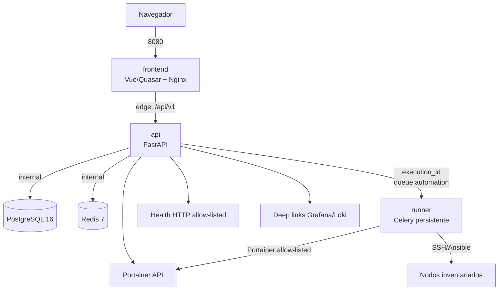

# Arquitectura de Capataz

*Idioma: **Español** · [English](01-architecture.en.md)*

## Componentes y límites de red

`frontend` y `api` comparten `edge`. `api`, `runner`, `postgres` y `redis` comparten `internal`; esta última es interna a Compose. PostgreSQL y Redis no se publican ni se unen a `edge` en el perfil de homelab. El `runner` no publica ningún puerto.

## Arquitectura hexagonal pragmática

El backend se organiza en `adapters`, `application`, `domain`, `infrastructure` y `core`:

- **Domain**: entidades, value objects, transiciones y excepciones. No importa FastAPI, SQLAlchemy, Celery ni clientes HTTP.
- **Application**: casos de uso, DTOs, políticas RBAC y puertos `Protocol`. Solo depende de dominio y abstracciones.
- **Adapters inbound**: routers FastAPI, schemas HTTP y autenticación; convierten HTTP a DTOs sin decisión de negocio.
- **Adapters outbound / infrastructure**: repositorios SQLAlchemy async, Celery, Portainer, health HTTP, secrets y observabilidad. Implementan puertos de aplicación.
- **Core**: `Settings`, logging y políticas transversales.

La dirección de dependencias apunta hacia el dominio. Un controller no contiene lógica de negocio y un caso de uso no conoce una implementación de persistencia, HTTP, Celery o el framework web. Esta separación permite cambiar el executor persistente por el efímero V2 sin reescribir los casos de uso.

## Flujo de una acción

1. El usuario autenticado solicita `POST /api/v1/services/{service_id}/actions/{action_key}/execute`.
2. La API resuelve el servicio y la definición persistida; valida rol, `risk_level`, confirmación y motivo para `critical`, parámetros enumerados y source.
3. La API crea `Execution` en estado `queued`, `AuditEvent` y un `X-Request-ID`/correlation ID; nunca pone comandos ni secretos en la cola.
4. Se publica exactamente `{"execution_id":"<uuid>"}` en la cola Redis `automation` mediante `capataz_runner.tasks.process_execution`.
5. El runner reclama atómicamente `queued -> running`, vuelve a cargar Service/ActionDefinition desde PostgreSQL y emite `ExecutionEvent` sanitizados.
6. Un adapter de Portainer o Ansible resuelve solo selectores, operación, playbook, inventory, limit y extra-vars presentes en la definición allow-listed.
7. El runner persiste un estado terminal, resumen seguro, eventos y la API expone el historial/SSE autenticado.

## Modelo de seguridad

- **Allow-list**: no hay endpoint ni payload para shell libre, container ID libre, URL de ejecución, playbook externo ni argumentos no validados.
- **Secretos**: Compose los entrega como archivos en `/run/secrets/<nombre>`; `api` los lee mediante un lector de archivos. No se guardan en `.env`, catálogo, resultados, logs o respuestas.
- **RBAC jerárquico**: `capataz-viewer` lee; `capataz-operator` ejecuta `read` y `operate`; `capataz-admin` administra, audita y ejecuta `critical`. La API aplica siempre la decisión.
- **Aislamiento**: filesystem de solo lectura donde es viable, tmpfs temporal, `cap_drop: ALL`, `no-new-privileges`, usuarios no root en imágenes que lo soporten y límites de recursos.
- **Integraciones**: URLs de health se validan contra SSRF y Portainer solo opera contenedores resueltos desde el catálogo.
- **Trazabilidad**: los cambios y ejecuciones guardan actor, source, resultado, timestamps y correlation ID. Los errores HTTP usan RFC 7807.

## Decisiones y límites V1

V1 usa un worker Celery persistente y Redis como broker/result backend. El API no contiene Ansible ni herramientas SSH. Grafana/Loki se resuelven como deep-links; Prometheus queda detrás de un puerto futuro, sin credenciales innecesarias. La migración a jobs Docker efímeros está especificada en [future-ephemeral-runner.md](11-future-ephemeral-runner.es.md) y las decisiones duraderas están en [ADRs](adr/).

La disponibilidad exacta de healthchecks remotos depende de Portainer y de configuraciones declaradas. Un servicio sin configuración suficiente se presenta como `unknown`; `maintenance` es una decisión administrativa con prioridad visual.

## Cobertura de los criterios de aceptación

| Criterio §20 | Evidencia prevista |
|---|---|
| 1–2 | Compose, healthchecks y `depends_on` con condición; `make up`, `make migrate`. |
| 3–5 | `catalog/services.example.yaml`, API de import/export, `make seed-catalog`, tests CRUD. |
| 6–8 | Adapter de auth, política RBAC y diálogo de confirmación `critical`. |
| 9–10 | Modelo Execution/AuditEvent, cola con solo `execution_id`, runner allow-listed. |
| 11–12 | Tests de estado/health y construcción de links declarados. |
| 13 | Separación de imágenes, servicios/redes y ausencia de puertos en runner. |
| 14–15 | Umbrales de cobertura, Makefiles y `.github/workflows/ci.yml`. |
| 16 | README y documentación bajo `docs/`. |
| 17 | Puerto y estrategia V2 documentados en el diseño del runner efímero. |
