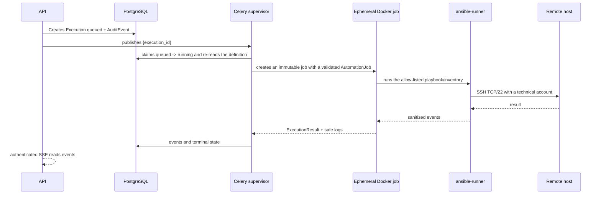

# Future design: per-execution ephemeral Docker runner (V2)

*Language: **English** · [Español](11-future-ephemeral-runner.es.md)*

V1 runs automations with a persistent Celery worker. That decision isn't part of the use case's semantics: the executor is abstracted so each execution can be isolated in an ephemeral container once volume, concurrency, or risk surface justify it.

## Proposed sequence



Job creation never receives a shell, an arbitrary playbook, a serialized secret, or a client payload. The supervisor builds the `AutomationJob` from the persisted action and writes the events before destroying the container.

## Application port

```python
from typing import Protocol

class AutomationExecutorPort(Protocol):
    async def execute(self, job: AutomationJob) -> ExecutionResult: ...
```

`AutomationJob` contains only `execution_id`, allow-listed/versioned playbook and inventory references, validated parameters, timeout, correlation ID, and references to mountable secrets. `ExecutionResult` contains terminal state, a safe summary, a normalized code/error, and sanitized events. Neither contains secret values.

## V1 implementation

`PersistentWorkerAutomationExecutor` implements the port inside the Celery runner process. It claims the execution, invokes the Portainer/Ansible adapters, enforces safe timeouts/retries, and persists events. It keeps automation credentials mounted on the runner. This option simplifies initial deployment and observability, but shares process, filesystem, and credential lifetime across jobs.

## V2 specification

`EphemeralDockerAutomationExecutor` acts as a supervisor: it creates one container per execution, waits for/collects its output, enforces a time limit, persists safe logs, and removes the job. The image name is immutable/versioned, e.g. `capataz-ansible-runner:<digest>`; the digest and job ID are recorded on the execution/audit trail for traceability.

### Mandatory container constraints

- Immutable `capataz-ansible-runner` image, versioned by digest.
- `--read-only` with `/tmp` on tmpfs; any Ansible temp directory also on tmpfs.
- Non-root user defined in the image, no capabilities: `--cap-drop=ALL`.
- `--security-opt no-new-privileges:true` and a restrictive seccomp/apparmor profile when the host supports it.
- Explicit `--pids-limit`, CPU, and memory; a supervisor timeout limit and an Ansible one.
- Dedicated network with restricted egress, at minimum only TCP/22 to inventory IPs/hosts where Docker/network policy allows it; no access to `edge`, PostgreSQL, or Redis.
- Read-only secrets mounted only for the execution; never as environment variables or arguments.
- Playbooks/inventories packaged or mounted read-only from an identifiable version.
- `--rm` on completion, with stdout/stderr collected and filtered before destruction; keep only sanitized events/results.
- No published ports, no privileges, no broad bind mounts, and no implicit host access.

## docker.sock risk and alternatives

Mounting `/var/run/docker.sock` normally allows creating privileged containers, mounting the host filesystem, and achieving control equivalent to host root. The API never mounts it. If the V2 supervisor needs to create jobs, the acceptable options in evaluation order are:

1. an isolated, authenticated **Docker socket proxy** with an allow-list of minimal endpoints/operations (create, inspect, logs, delete only Capataz-labeled jobs);
2. a dedicated job-runner service with an authenticated API and an admission policy;
3. migrating the ephemeral unit to **Kubernetes Jobs**, using the cluster's RBAC/NetworkPolicies/Secrets.

A direct socket on the runner container would only be accepted after an explicit risk analysis, and it is not the target design.

## V1 → V2 migration criteria

Migrate once a combination of the following holds: need for per-execution or multi-tenant isolation, compliance requirements, concurrency that makes sharing a runtime risky, need to version tools per job, or operational maturity to manage ephemeral jobs. Before enabling V2, the following must exist:

1. `AutomationExecutorPort` equivalence covered by contract tests;
2. job creation without a direct docker.sock, or with a validated minimal-privilege proxy;
3. demonstrable single-use/read-only secret delivery and restricted networking;
4. propagation of correlation ID, events, timeout, cancellation, and sanitized logs;
5. reliable cleanup on success, failure, timeout, and supervisor crash;
6. metrics, image digest/job ID audit trail, feature-flag rollback, and canary execution;
7. security, load, and recovery tests demonstrating that no `Execution` is lost.

V2 is enabled first for an allow-list of low-risk playbooks, keeping V1 as a fallback while timings, failures, and resource cleanup are observed.
