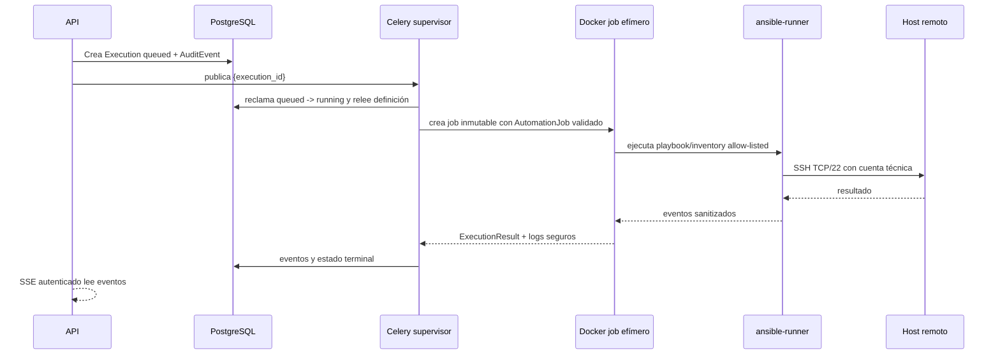

# Diseño futuro: runner Docker efímero por ejecución (V2)

*Idioma: **Español** · [English](11-future-ephemeral-runner.en.md)*

V1 ejecuta automatizaciones con un worker Celery persistente. La decisión no forma parte de la semántica del caso de uso: el executor se abstrae para poder aislar cada ejecución en un contenedor efímero cuando el volumen, concurrencia o superficie de riesgo lo justifiquen.

## Secuencia propuesta



La creación del job no recibe un shell, playbook arbitrario, secret serializado ni un payload de cliente. El supervisor construye `AutomationJob` desde la acción persistida y escribe los eventos antes de destruir el contenedor.

## Puerto de aplicación

```python
from typing import Protocol

class AutomationExecutorPort(Protocol):
    async def execute(self, job: AutomationJob) -> ExecutionResult: ...
```

`AutomationJob` contiene solamente `execution_id`, referencias allow-listed/versionadas de playbook e inventario, parámetros validados, timeout, correlation ID y referencias a secretos montables. `ExecutionResult` contiene estado terminal, resumen seguro, código/error normalizado y eventos sanitizados. Ninguno contiene valores de secretos.

## Implementación V1

`PersistentWorkerAutomationExecutor` implementa el puerto dentro del proceso runner Celery. Reclama la ejecución, invoca adapters Portainer/Ansible, impone timeout/reintentos seguros y persiste eventos. Conserva credenciales de automatización montadas en el runner. Esta opción simplifica despliegue y observabilidad inicial, pero comparte proceso, filesystem y vida de credenciales entre trabajos.

## Especificación V2

`EphemeralDockerAutomationExecutor` actúa como supervisor: crea un contenedor por ejecución, espera/recoge salida, aplica límite de tiempo, persiste logs seguros y elimina el job. El nombre de imagen es inmutable/versionado, por ejemplo `capataz-ansible-runner:<digest>`; se registra digest e ID de job en ejecución/auditoría para trazabilidad.

### Restricciones obligatorias del contenedor

- Imagen `capataz-ansible-runner` inmutable y versionada por digest.
- `--read-only` y `/tmp` en tmpfs; cualquier directorio temporal Ansible también tmpfs.
- Usuario no root definido en imagen, sin capacidades: `--cap-drop=ALL`.
- `--security-opt no-new-privileges:true` y perfil seccomp/apparmor restrictivo cuando el host lo admita.
- `--pids-limit`, CPU y memoria explícitos; límite de timeout supervisor y de Ansible.
- Red dedicada con salida limitada, como mínimo solo TCP/22 a IP/hosts del inventario cuando Docker/network policy lo permita; sin acceso a `edge`, PostgreSQL ni Redis.
- Secrets de solo lectura montados únicamente para la ejecución; nunca como environment ni en argumentos.
- Playbooks/inventarios empaquetados o montados read-only desde una versión identificable.
- `--rm` al finalizar y recolección de stdout/stderr filtrada antes de destrucción; conservar solo eventos/resultados sanitizados.
- No puertos publicados, no privilegios, no bind mounts amplios y no acceso implícito al host.

## Riesgo de docker.sock y alternativas

Montar `/var/run/docker.sock` permite normalmente crear contenedores privilegiados, montar el filesystem del host y lograr control equivalente a root del host. API jamás lo monta. Si el supervisor V2 necesita crear jobs, las opciones aceptables por orden de evaluación son:

1. un **Docker socket proxy** aislado, autenticado y con allow-list de endpoints/operaciones mínimas (crear, inspeccionar, logs, eliminar solo jobs etiquetados Capataz);
2. un servicio de job runner dedicado con API autenticada y política de admisión;
3. migrar la unidad efímera a **Kubernetes Jobs**, usando RBAC/NetworkPolicies/Secrets del clúster.

Un socket directo en el contenedor runner solo se aceptaría tras análisis de riesgo explícito y no es el diseño objetivo.

## Criterios de migración V1 → V2

Migra cuando se cumpla una combinación de: necesidad de aislamiento por ejecución o multi-tenant, requisitos de cumplimiento, concurrencia que haga riesgoso compartir runtime, necesidad de versionar herramientas por job, o madurez operativa para gestionar jobs efímeros. Antes de activar V2 debe existir:

1. equivalencia de `AutomationExecutorPort` cubierta por contract tests;
2. creación de job sin docker.sock directo o con proxy de mínimo privilegio validado;
3. delivery de secretos de un solo uso/solo lectura y red restringida demostrable;
4. propagación de correlation ID, eventos, timeout, cancelación y logs sanitizados;
5. limpieza fiable ante éxito, fallo, timeout y caída del supervisor;
6. métricas, auditoría de imagen digest/job ID, rollback por feature flag y ejecución canary;
7. pruebas de seguridad, carga y recuperación que demuestren que no se pierde una `Execution`.

La V2 se activa primero para una allow-list de playbooks de bajo riesgo, manteniendo V1 como fallback mientras se observan tiempos, fallos y limpieza de recursos.
